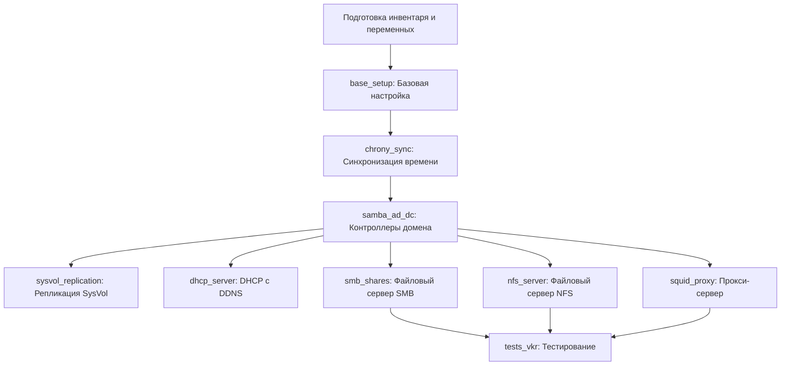

# Коллекция Ansible: shoelacevip12.Altlinux_VKR_2026

> **Внимание**: Коллекция разработана в образовательных целях в рамках выпускной квалификационной работы (ВКР). Не рекомендуется для использования в производственной среде без предварительного аудита безопасности и адаптации.

## Описание

Коллекция предназначена для автоматизированного развёртывания и настройки гибридной сетевой инфраструктуры на базе **ALT Linux p10** в составе домена **Samba Active Directory**, включая:

- Контроллеры домена с репликацией
- DHCP-сервер с failover и динамическим обновлением DNS (DDNS)
- Файловые серверы SMB и NFS с Kerberos-аутентификацией
- Прокси-сервер Squid с аутентификацией через Kerberos и контролем доступа по доменным группам
- Синхронизация времени через Chrony с иерархической схемой

---

## Структура коллекции

```
Altlinux_VKR_2026/
├── ansible.cfg                    # Локальная конфигурация Ansible
├── main.yaml                      # Главный плейбук-оркестратор
├── *.yaml                         # Отдельные плейбуки для каждой роли
├── inventory/
│   ├── inventory                  # Инвентарь в формате INI
│   └── group_vars/
│       └── all/
│           ├── all.yml           # Глобальные переменные
│           └── vault             # Зашифрованные данные (Ansible Vault)
├── roles/
│   ├── base_setup/               # Базовая настройка хостов
│   ├── chrony_sync/              # Синхронизация времени
│   ├── samba_ad_dc/              # Контроллеры домена Samba AD
│   ├── dhcp_server/              # DHCP с failover и DDNS
│   ├── sysvol_replication/       # Репликация SysVol через Unison/rsync
│   ├── smb_shares/               # Файловый сервер SMB
│   ├── nfs_server/               # Файловый сервер NFS с Kerberos
│   ├── squid_proxy/              # Прокси Squid с Kerberos-аутентификацией
│   └── tests_vkr/                # Тестирование инфраструктуры
├── va_pa                          # Файл пароля для Ansible Vault
└── README.md
```

### Структура каждой роли

```
roles/<role_name>/
├── tasks/
│   ├── main.yml                  # Точка входа задач
│   └── *.yml                     # Дополнительные файлы задач (include_tasks)
├── handlers/
│   └── main.yml                  # Обработчики событий
├── templates/
│   └── *.j2                      # Шаблоны Jinja2 для конфигурационных файлов
├── files/
│   └── *                         # Статические файлы для копирования
├── vars/
│   └── main.yml                  # Постоянные переменные роли
├── defaults/
│   └── main.yml                  # Переменные по умолчанию (переопределяемые)
└── README.md                     # Документация роли (опционально)
```

---

## Требования

### Управляющий узел (Control Node)
- ОС: Linux (протестировано на ALT Linux p10)
- Ansible: 2.9+ или ansible-core 2.12+
- Python 3 с модулями: `jinja2`, `yaml`
- SSH-доступ к управляемым узлам с использованием ключей
- Учётная запись с правами `sudo`/`su` для выполнения привилегированных задач

### Управляемые узлы (Managed Nodes)
- ОС: ALT Linux p10 (или совместимые дистрибутивы)
- Открытый порт 22 (SSH) для подключения
- Учётная запись с правами повышения привилегий
- Сетевая связность между всеми узлами инфраструктуры

### Дополнительные требования
- Настроенные обратные зоны DNS для динамического обновления
- Внешний NTP-сервер для синхронизации времени
- Свободные порты для служб: 53 (DNS), 88 (Kerberos), 123 (NTP), 389/636 (LDAP), 445 (SMB), 3128 (Squid)

---

## Быстрый старт

### 1. Клонирование репозитория

```bash
git clone https://github.com/shoelacevip12/Altlinux_VKR_2026.git
cd Altlinux_VKR_2026
```

### 2. Установка зависимостей

```bash
# Установка коллекций из Galaxy
ansible-galaxy collection install community.general ansible.posix

# Проверка конфигурации
ansible --version
ansible-config dump | grep -i collection
```

### 3. Настройка инвентаря

Отредактируйте файл `inventory/inventory` под вашу сеть:

```ini
[domain_controllers]
altsrv2 ansible_host=192.168.100.12
altsrv3 ansible_host=192.168.100.13

[file_servers]
altsrv4 ansible_host=192.168.100.14

[proxy_servers]
altsrv1 ansible_host=192.168.100.11

[clients]
192.168.100.2
# 192.168.100.[50:254]

[all:children]
domain_controllers
file_servers
proxy_servers
clients
```

### 4. Настройка переменных

#### Глобальные переменные (`inventory/group_vars/all/all.yml`)

```yaml
# Параметры домена
ad_workgroup: "den.skv"
ad_realm: "DEN.SKV"
ad_domain: "DEN"
ad_admin_user: "Administrator"
dns_forwarder: "77.88.8.8"

# Динамические ссылки на хосты
primary_dc: "{{ groups['domain_controllers'][0] }}"
primary_dc_ip: "{{ hostvars[primary_dc]['ansible_host'] }}"
secondary_dc: "{{ groups['domain_controllers'][1] }}"
secondary_dc_ip: "{{ hostvars[secondary_dc]['ansible_host'] }}"

# Управление включением ролей
base_setup: true
chrony_sync: true
samba_ad_dc: true
dhcp_server: true
sysvol_replication: true
smb_shares: true
nfs_server: true
squid_proxy: true
tests_vkr: false  # Включать только после развёртывания

# Параметры Chrony
exter_ntp: ntp3.vniiftri.ru
allow_clients: "192.168.100.0/24"

# Параметры сети DHCP
network_subnet: "192.168.100.0"
network_netmask: "255.255.255.0"
network_gateway: "192.168.100.1"
dhcp_range: "192.168.100.50 192.168.100.254"
lease_time: "172800"
```

#### Чувствительные данные (`inventory/group_vars/all/vault`)

Зашифрованный файл должен содержать:

```yaml
---
ad_admin_password: "Ваш_Пароль_Администратора"
ansible_become_password: "Пароль_суперпользователя"
vault_omapi_secret: "KsP/KnIQcoQF5fMMjBcOhg=="  # Для DHCP failover
```

**Создание/редактирование vault:**
```bash
# Создать новый зашифрованный файл
ansible-vault create inventory/group_vars/all/vault --vault-password-file ./va_pa

# Редактировать существующий
ansible-vault edit inventory/group_vars/all/vault --vault-password-file ./va_pa

# Просмотр содержимого
ansible-vault view inventory/group_vars/all/vault --vault-password-file ./va_pa
```

### 5. Запуск развёртывания

```bash
# Запуск полного плейбука
ansible-playbook -i inventory/inventory main.yaml \
  --vault-password-file ./va_pa

# Запуск отдельной роли (например, только Samba AD)
ansible-playbook -i inventory/inventory samba_ad_dc.yaml \
  --vault-password-file ./va_pa

# Запуск с проверкой (dry-run)
ansible-playbook -i inventory/inventory main.yaml \
  --vault-password-file ./va_pa --check --diff

# Запуск с подробным выводом отладки
ansible-playbook -i inventory/inventory main.yaml \
  --vault-password-file ./va_pa -vvv
```

---

## Описание ролей

### base_setup
**Назначение**: Первоначальная подготовка всех хостов инфраструктуры.

**Задачи**:
- Обновление кеша пакетов и установленных приложений (`apt_rpm`)
- Обновление ядра системы
- Установка имени хоста в формате `имя.домен`
- Автоопределение основного сетевого интерфейса
- Настройка DNS-резолвера через шаблон
- Отключение IPv6 через sysctl с созданием systemd-службы для применения после загрузки
- Перезагрузка хоста после завершения настроек

**Ключевые переменные**:
| Переменная | По умолчанию | Описание |
|-----------|-------------|----------|
| `dist_upd` | `true` | Обновление кеша пакетов |
| `dist_upgrd` | `true` | Обновление установленных пакетов |
| `kernel_upd` | `true` | Обновление ядра системы |

---

### chrony_sync
**Назначение**: Иерархическая синхронизация времени через Chrony.

**Архитектура**:
```
Внешний NTP-сервер
       ↓
[Основной DC] ←→ [Вторичный DC]
       ↓              ↓
   [Все клиенты домена]
```

**Задачи**:
- Настройка `chrony.conf` с учётом роли хоста (основной/вторичный DC, клиент)
- Разрешение синхронизации для подсети клиентов (`allow {{ allow_clients }}`)
- Автоматический перезапуск службы при изменении конфигурации

**Ключевые переменные**:
| Переменная | По умолчанию | Описание |
|-----------|-------------|----------|
| `exter_ntp` | `ntp3.vniiftri.ru` | Внешний NTP-сервер |
| `allow_clients` | `192.168.100.0/24` | Разрешённая подсеть для синхронизации |

---

### samba_ad_dc
**Назначение**: Развёртывание контроллеров домена Samba Active Directory.

**Задачи**:
- Остановка и маскирование конфликтующих служб (smb, nmb, bind, slapd, krb5kdc)
- Установка пакета `task-samba-dc`
- **Provisioning основного DC**:
  - Настройка параметров домена, DNS-бэкенда, политик обновлений
  - Создание обратной зоны DNS и PTR-записей
- **Присоединение вторичного DC**:
  - Репликация данных через `samba-tool domain join`
  - Принудительная репликация через `samba-tool drs replicate`
- Настройка резолвера и конфигурации Kerberos для клиентского доступа

**Ключевые переменные**:
| Переменная | По умолчанию | Описание |
|-----------|-------------|----------|
| `ad_backend` | `SAMBA_INTERNAL` | DNS-бэкенд для Samba |
| `dns_refresh` | `720` | Интервал обновления DNS (сек) |
| `ptr_zone` | `100.168.192.in-addr.arpa` | Обратная зона DNS |
| `ldap_search` | `dc=den,dc=skv` | Base DN для LDAP-запросов |

**Важно**: Пароли передаются через аргументы команд. Убедитесь, что:
- Используется `no_log: true` в задачах с чувствительными данными
- Файл `va_pa` имеет права `600` и не попадает в систему контроля версий

---

### dhcp_server
**Назначение**: Настройка DHCP-сервера с поддержкой failover и динамическим обновлением DNS.

**Возможности**:
- Поддержка failover между двумя контроллерами домена
- Динамическое обновление A/PTR-записей через скрипт `dhcp-dyndns.sh`
- Аутентификация службы DHCP в домене через keytab-файл
- OMAPI для мониторинга и управления состоянием failover

**Архитектура DDNS**:
```
DHCP-сервер → [dhcpduser@DOMAIN] → samba-tool → Обновление DNS
                    ↓
            keytab-файл для Kerberos-аутентификации
```

**Ключевые переменные**:
| Переменная | По умолчанию | Описание |
|-----------|-------------|----------|
| `network_subnet` | `192.168.100.0` | Сетевой адрес подсети |
| `dhcp_range` | `192.168.100.50 192.168.100.254` | Диапазон выдаваемых адресов |
| `lease_time` | `172800` | Время аренды по умолчанию (2 дня) |
| `vault_omapi_secret` | *из vault* | Секрет для OMAPI-аутентификации |

**Скрипт динамического DNS** (`roles/dhcp_server/files/dhcp-dyndns.sh`):
- Поддерживает операции `add`/`delete` для записей A и PTR
- Использует Kerberos-аутентификацию через keytab
- Логгирует все операции в syslog
- Требует, чтобы пользователь `dhcpduser` был в группе `DnsAdmins`

---

### sysvol_replication
**Назначение**: Двунаправленная репликация каталога `SysVol` между контроллерами домена.

**Механизм**:
1. Генерация SSH-ключей ED25519 для аутентификации между DC
2. Настройка конфигурации Unison для синхронизации `/var/lib/samba/sysvol`
3. Первоначальная синхронизация через `rsync` с сохранением расширенных атрибутов (`-XA`)
4. Автоматическая синхронизация каждые 5 минут через `systemd timer`

**Ключевые переменные**:
| Переменная | По умолчанию | Описание |
|-----------|-------------|----------|
| `ssh_sysvol_path` | `/root/.ssh/id_sysvol_ed25519` | Путь к SSH-ключу для репликации |
| `synchron_path` | `/var/lib/samba/sysvol` | Путь к синхронизируемому каталогу |

**Важно**: Репликация `SysVol` критична для работы групповых политик (GPO). Убедитесь, что:
- Сеть между контроллерами стабильна
- Временные расхождения между серверами минимальны (< 5 минут)
- Права на каталог `sysvol` сохраняются при синхронизации

---

### smb_shares
**Назначение**: Настройка файлового сервера SMB с доменной аутентификацией.

**Задачи**:
- Регистрация DNS-записей для сервера файлов
- Создание доменных групп и пользователей через `samba-tool`
- Присоединение сервера к домену через `system-auth`
- Настройка `smb.conf` с параметрами безопасности `security = ads`
- Создание общих ресурсов с гибким управлением правами доступа

**Пример конфигурации ресурсов** (`smb_shares_config`):
```yaml
smb_shares_config:
  Work:
    comment: "Для работы пользователям домена"
    path: "/srv/smb/work"
    writable: "yes"
    guest_ok: "no"
    read_list: "'+Domain Users' '+Domain Admins'"
    write_list: "'+Domain Users' '+Domain Admins'"
    browseable: "yes"
    create_mask: "0770"
    directory_mask: "0770"
```

**Ключевые переменные**:
| Переменная | Описание |
|-----------|----------|
| `spec_smb_gr1` | Имя специальной доменной группы для ограниченного доступа |
| `samba_users` | Словарь пользователей для создания в домене |
| `smb_shares_config` | Конфигурация общих ресурсов (путь, права, маски) |

---

### nfs_server
**Назначение**: Настройка файлового сервера NFS с поддержкой Kerberos-аутентификации (SECURE_NFS).

**Особенности**:
- Включение режима `SECURE_NFS=yes` в `/etc/sysconfig/nfs`
- Создание принципала `nfs/hostname@REALM` и добавление в keytab
- Настройка экспорта с опциями `sec=krb5:krb5i:krb5p`
- Интеграция с доменом для разрешения имён пользователей и групп через SSSD

**Пример экспорта** (`/etc/exports`):
```
/srv/smb/work  192.168.100.0/24(rw,no_subtree_check,sec=krb5:krb5i:krb5p)
```

**Ключевые переменные**:
| Переменная | По умолчанию | Описание |
|-----------|-------------|----------|
| `main_nfs_options` | `rw,no_subtree_check` | Базовые опции экспорта |
| `secure_nfs_options` | `,sec=krb5:krb5i:krb5p` | Опции Kerberos-безопасности |

---

### squid_proxy
**Назначение**: Развёртывание прокси-сервера Squid с аутентификацией через домен.

**Механизм аутентификации**:
```
Пользователь → Kerberos Ticket → negotiate_kerberos_auth → Squid
                                          ↓
                          ext_kerberos_ldap_group_acl → Проверка группы
```

**Задачи**:
- Создание группы доступа (по умолчанию `proxy_acc`) и добавление разрешённых пользователей
- Получение принципала `HTTP/hostname@REALM` для аутентификации прокси
- Настройка `negotiate_kerberos_auth` для прозрачной аутентификации
- Интеграция с `ext_kerberos_ldap_group_acl` для контроля доступа по группам домена

**Ключевые переменные**:
| Переменная | По умолчанию | Описание |
|-----------|-------------|----------|
| `proxy_group` | `proxy_acc` | Доменная группа с правом доступа к прокси |
| `negotiate_param` | `children 20 startup=0 idle=1` | Параметры helper-аутентификации |
| `cache_mem` | `1024 MB` | Размер оперативной памяти для кэша |
| `cache_dir` | `ufs /var/spool/squid 2048 16 256` | Параметры дискового кэша |
| `max_obj_size` | `100 MB` | Максимальный размер кэшируемого объекта |

**Проверка доступа**:
```bash
# Разрешённый пользователь
printf '%s\n' 'пароль' | kinit samba_u1
curl --proxy-negotiate --proxy-user : -x http://altsrv1:3128 https://2ip.ru

# Запрещённый пользователь (должен вернуть 407)
printf '%s\n' 'пароль' | kinit samba_u2
curl --proxy-negotiate --proxy-user : -x http://altsrv1:3128 https://2ip.ru
```

---

### tests_vkr
**Назначение**: Автоматизированное тестирование развёрнутой инфраструктуры.

**Возможности**:
- Проверка доступности хостов через `nmap` и динамическое добавление в группу `reachable_clients`
- Ввод тестовых клиентов в домен с применением групповых политик
- Тестирование доступа к прокси под разными учётными записями
- Проверка видимости и прав доступа к ресурсам SMB
- Верификация экспортированных ресурсов NFS через `showmount`

**Запуск тестов**:
```bash
# Только тестирование (предполагается, что инфраструктура уже развёрнута)
ansible-playbook -i inventory/inventory tests_vkr.yaml \
  --vault-password-file ./va_pa -e "tests_vkr=true"

# Тестирование с выводом результатов
ansible-playbook -i inventory/inventory tests_vkr.yaml \
  --vault-password-file ./va_pa -vv | grep -E "(OK|FAILED|msg:)"
```

---

## Безопасность

### Рекомендации по защите чувствительных данных

1. **Ansible Vault**:
   ```bash
   # Генерация надёжного пароля для vault
   tee ./va_pa <<< $(pwgen -s 32 1) && chmod 600 ./va_pa
   
   # Шифрование файла с паролями
   ansible-vault encrypt inventory/group_vars/all/vault \
     --vault-password-file ./va_pa
   ```

2. **SSH-ключи**:
   - Используйте алгоритм `ed25519` для новых ключей
   - Ограничьте права: `chmod 600 ~/.ssh/id_*`, `chmod 644 ~/.ssh/id_*.pub`
   - Не храните приватные ключи в репозитории

3. **Пароли в логах**:
   - Все задачи с передачей паролей помечены `no_log: true`
   - При отладке (`-vvv`) убедитесь, что чувствительные данные не попадают в вывод

4. **Сетевая безопасность**:
   - Ограничьте доступ к службам (SMB, LDAP, Kerberos) только доверенными подсетями
   - Используйте firewall (`iptables`/`nftables`) для фильтрации входящих соединений

---

## Устранение неполадок

### Ошибка: `Permission denied (publickey)`
```bash
# Проверка прав на ключ
ls -la ~/.ssh/id_skv_VKR_vpn*
chmod 600 ~/.ssh/id_skv_VKR_vpn

# Проверка наличия ключа в агенте
ssh-add -l
ssh-add ~/.ssh/id_skv_VKR_vpn

# Тестовое подключение
ssh -i ~/.ssh/id_skv_VKR_vpn sysadmin@192.168.100.12 "echo OK"
```

### Ошибка: `Join is OK` не возвращается при присоединении к домену
```bash
# Проверка связи с контроллером домена
wbinfo -t
net ads testjoin -S altsrv2.den.skv

# Проверка времени (расхождение > 5 минут ломает Kerberos)
chronyc tracking
ntpdate -q altsrv2.den.skv

# Переприсоединение с очисткой кэша
net ads leave -U Administrator
rm -rf /var/lib/samba/private/secrets.tdb
# Повторный запуск плейбука
```

### Ошибка: `407 Proxy Authentication Required` в Squid
```bash
# Проверка наличия принципала HTTP
klist -k /etc/krb5.keytab | grep HTTP

# Проверка членства пользователя в группе proxy_acc
wbinfo -g samba_u1 | grep proxy_acc

# Проверка конфигурации Squid
squid -k parse
tail -f /var/log/squid/access.log | grep -i denied
```

### Ошибка: Репликация SysVol не работает
```bash
# Проверка SSH-доступа между контроллерами
ssh -i /root/.ssh/id_sysvol_ed25519 root@altsrv3 "echo OK"

# Проверка состояния Unison
unison sync_dc2 -test

# Просмотр логов синхронизации
tail -f /var/log/sysvol-sync.log

# Проверка таймера systemd
systemctl list-timers | grep sysvol
systemctl status sysvol-sync.service
```

### Ошибка: `fatal: [host]: FAILED! => {"msg": "The task includes an option with an undefined variable"}`
```bash
# Проверка определения переменных
ansible -i inventory/inventory all -m debug -a "var=ad_realm" --vault-password-file ./va_pa

# Проверка инвентаря
ansible-inventory -i inventory/inventory --graph

# Запуск с отладкой шаблонов
ansible-playbook -i inventory/inventory main.yaml \
  --vault-password-file ./va_pa --diff --check
```

---

## Переменные: полный справочник

### Глобальные переменные (`group_vars/all/all.yml`)

| Переменная | Тип | Обязательная | Описание |
|-----------|-----|-------------|----------|
| `ad_workgroup` | string | да | Имя рабочей группы/домена в нижнем регистре |
| `ad_realm` | string | да | Kerberos-реалм в верхнем регистре |
| `ad_domain` | string | да | Короткое имя домена (NetBIOS) |
| `ad_admin_user` | string | да | Имя учётной записи администратора домена |
| `dns_forwarder` | string | да | Внешний DNS-сервер для форвардинга запросов |
| `primary_dc` | string | да | Имя хоста основного контроллера домена (динамическое) |
| `primary_dc_ip` | string | да | IP-адрес основного контроллера (динамическое) |
| `proxy_server` | string | нет | Адрес прокси для тестов (`хост:порт`) |
| `file_server` | string | нет | Имя хоста файлового сервера для тестов |

### Переменные управления ролями

| Переменная | Значение по умолчанию | Эффект |
|-----------|----------------------|--------|
| `base_setup` | `false` | Включает базовую настройку хостов |
| `chrony_sync` | `false` | Включает настройку синхронизации времени |
| `samba_ad_dc` | `false` | Включает развёртывание контроллеров домена |
| `dhcp_server` | `false` | Включает настройку DHCP с failover |
| `sysvol_replication` | `false` | Включает репликацию SysVol (зависит от `samba_ad_dc`) |
| `smb_shares` | `false` | Включает настройку файлового сервера SMB |
| `nfs_server` | `false` | Включает настройку файлового сервера NFS |
| `squid_proxy` | `false` | Включает настройку прокси-сервера Squid |
| `tests_vkr` | `true` | Включает тестирование инфраструктуры |

> **Рекомендация развертывания ролей**: Для поэтапного развёртывания включайте роли последовательно, начиная с `base_setup` → `chrony_sync` → `samba_ad_dc`.

---

## Порядок развёртывания



**Пошаговый запуск**:
```bash
# Этап 1: Базовая подготовка
ansible-playbook -i inventory/inventory main.yaml \
  --vault-password-file ./va_pa \
  -e "base_setup=true chrony_sync=true" -e "samba_ad_dc=false dhcp_server=false"

# Этап 2: Контроллеры домена
ansible-playbook -i inventory/inventory main.yaml \
  --vault-password-file ./va_pa \
  -e "samba_ad_dc=true sysvol_replication=true"

# Этап 3: Сетевые службы
ansible-playbook -i inventory/inventory main.yaml \
  --vault-password-file ./va_pa \
  -e "dhcp_server=true smb_shares=true nfs_server=true squid_proxy=true"

# Этап 4: Тестирование
ansible-playbook -i inventory/inventory main.yaml \
  --vault-password-file ./va_pa \
  -e "tests_vkr=true" -e "base_setup=false samba_ad_dc=false"
```

---

## Лицензия и ограничения

Коллекция распространяется **исключительно в образовательных целях** в рамках выпускной квалификационной работы.

### Ограничения использования:
- Не гарантирует безопасность для производственного использования
- Не включает механизмы резервного копирования и аварийного восстановления
- Использует упрощённые настройки безопасности (требуют аудита)
- Не поддерживает масштабирование более 2 контроллеров домена без доработки

### Рекомендации для продакшена:
1. Проведите аудит безопасности конфигураций
2. Настройте централизованное логирование и мониторинг
3. Реализуйте процедуру резервного копирования `sam.ldb` и `sysvol`
4. Настройке межсетевое экранирование между сегментами инфраструктуры
5. Протестируйте процедуру аварийного восстановления

---

## Приложения

### Приложение А: Пример полного инвентаря

```ini
# inventory/inventory
altwks1 ansible_host=192.168.100.1

[domain_controllers]
altsrv2 ansible_host=192.168.100.12 ansible_user=sysadmin
altsrv3 ansible_host=192.168.100.13 ansible_user=sysadmin

[file_servers]
altsrv4 ansible_host=192.168.100.14 ansible_user=sysadmin

[proxy_servers]
altsrv1 ansible_host=192.168.100.11 ansible_user=sysadmin

[clients]
192.168.100.2
192.168.100.[50:60]

[all:vars]
ansible_python_interpreter=/usr/bin/python3
ansible_ssh_private_key_file=~/.ssh/id_skv_VKR_vpn
ansible_become_method=su
ansible_become_user=root

[all:children]
domain_controllers
file_servers
proxy_servers
clients
```

### Приложение Б: Минимальный набор переменных для старта

```yaml
# inventory/group_vars/all/all.yml (минимум)
---
ad_workgroup: "den.skv"
ad_realm: "DEN.SKV"
ad_domain: "DEN"
ad_admin_user: "Administrator"
dns_forwarder: "77.88.8.8"

# Включение только базовых ролей для теста
base_setup: true
chrony_sync: true
samba_ad_dc: true

# Остальные роли отключены
dhcp_server: false
sysvol_replication: false
smb_shares: false
nfs_server: false
squid_proxy: false
tests_vkr: false
...
```

### Приложение В: Проверка успешного развёртывания

```bash
# 1. Проверка домена
net ads testjoin && echo "Join to domain OK"

# 2. Проверка DNS
dig @192.168.100.12 den.skv SOA +short && echo "DNS zone OK"

# 3. Проверка DHCP
systemctl is-active dhcpd && echo "DHCP service running"

# 4. Проверка SMB
smbclient -L //altsrv4 -U% -N | grep -q "Work" && echo "SMB shares visible"

# 5. Проверка NFS
showmount -e altsrv4 | grep -q "/srv/smb" && echo "NFS exports OK"

# 6. Проверка Squid
curl --proxy http://altsrv1:3128 -I https://example.com | grep -q "200" && echo "Proxy working"
```

---

> **Примечание автора**: Данная коллекция демонстрирует возможности автоматизации инфраструктуры с использованием Ansible, Samba AD и смежных технологий. Код открыт для изучения, модификации и использования в учебных целях. При использовании в реальных проектах требуется адаптация под конкретные требования безопасности и архитектуры.
